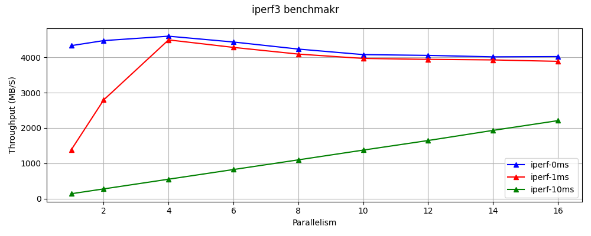

# BRPC Benchmarker

测试BRPC使用不同的方式，传输大量binary数据的性能表现。

测试不同的传输方式包括：
- 以bytes data的形式放在proto中；
- 以attachment的形式放在cntl中；
- 以streaming的方式；

其中attachment会绕过protobuf的序列化/反序列化和BRPC框架的压缩过程，[详细说明见官方文档](https://brpc.apache.org/docs/client/basics/#attachment)。

其中streaming可以参考[brpc对streaming的描述](https://brpc.apache.org/docs/client/streaming-rpc/)。简单来说，一个streaming由一次RPC触发而建立，client/server均可以往streaming中持续读/写数据。

Streaming的设计意图在于C/S段建立一个流式数据通道，从而持续的收发数据，而且创建一个新的streaming的代价较高，因此本文对streaming的测试方式有两种：
- Single-streaming: 不复用streaming，每次重新创建新的streaming，发送完payload之后关闭streaming；
- Continue-streaming: 复用streaming，一个client只在开始时创建一个streaming，之后所有的数据均通过此streaming发送/接受；

下文所有关于Streaming的测试，除非特殊说明，均使用Continue-streaming的方式。

其中Continue-streaming的single_msg_size为payload_size。

测试分为以下几个大类：
- 固定并发度、延迟，测试不同payload size下，不同方式的concurency/thourghput;
- ~~固定payload size，测试不同并发下，不同方式的delay/thourghput;~~

# Benchmark Result

所有原始结果数据位于目录`./result/`。

测试的机器采用lab-wroker2(96c192t)，
测试方法为：Client/Server均运行在同一个docker中，，使用`127.0.0.1`为server address, 通过`tc qdisc add dev lo root netem delay Xms`设定localhost延迟。
其中Continue-streaming的`single_msg_size=req_size`

## Iperf3 Test
测试本地TCP连接的throughput，设定`delay=0ms/1ms/10ms`：




## Request Size
当`delay=1ms`时，单个Client的Throughput/Lantency vs Request Size数据如下：

_para(1)_streamsz(8k)_prot(baidu_std).png)

可以看到，使用proto的方式进行传输，在req_size较大时，Lantency/Throughput表现均劣化，估计是受到了序列化/反序列化的性能影响。
当`req_size=45MB`时，所有方式throughput还未劣化，后文所有的具体分析均取此时的数据进行分析。

在总体的传输throughput上，Streaming的方式基本相比attachment, proto的方式均有很大的优势，当`single_msg_size`较大时会显著降低throughput，因此使用streaming应当避免一次性发送过大的massage，官方对此在文档中的说明为：
>We do not support segment large messages automatically so that multiple Streams on a single TCP connection may lead to Head-of-line blocking problem. Please avoid putting huge data into single message until we provide automatic segmentation.

## Parallel
保持`delay=1ms`，使用1/2/4个Client进行并发传输，总Throughput/Lantency vs Request Size数据如下：

_reqsz(256-256m)_paras_streamsz(8k)_prot(baidu_std).png)

结果表示，并发调用对BRPC的throughput有一定的帮助，使用两个client进行通讯可以将throughput几乎翻倍，但当parallelism从2提升到4之后，对throughput的提升非常有限, 但RPC的latency却提升了。取具体数值进行分析：

| req_size=45MB | Poto (P=1) | Poto (P=2) | Poto (P=4)      | Attachment (P=1) | Attachment (P=2) | Attachment (P=4)  |
| -----------  | -----------  | ---------- | ----------      | -----------  | ---------- | ----------      |
| Throughput   | 263.0 (100%) | 473.2 (180%) | 870.4 (331%)  | 347.8 (100%) | 606.8 (174%) | 991.6 (285%) |
| Latency      | 144.6 (100%) | 198.0 (137%) | 315.9 (218%)  | 127.0 (100%) | 168.8 (133%) | 263.6 (208%) |


## Latency
使用单个Client，设定`latency=0ms/1ms/10ms`，Throughput/Lantency vs Request Size数据如下：

_para(1)_streamsz(8k)_prot(baidu_std).png)

同时，结果显示，当lantency较大时，所有传输方式的throughput均有很大程度下降。理论上来说所有的协议均使用同一个channel，即同一个TCP连接，在latency增加时发送rpc/streaming的throughput不应该下降，暂时还未找到导致此现象的原因。


## Different Protocal

_para(1)_streamsz(8k)_prots.png)


# Run The Benchmark

```bash
./run_benchmark.sh
```